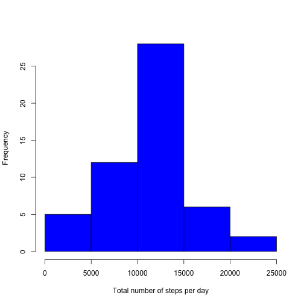
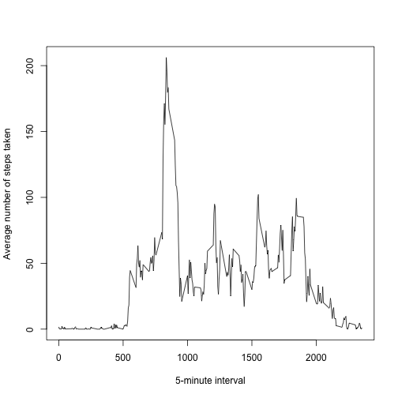
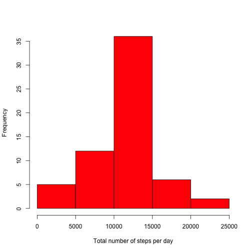
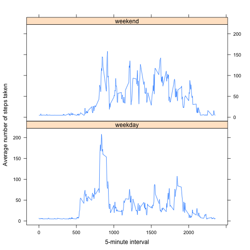

## Loading and preprocessing the data
- 1. Load the data (i.e. read.csv())

```r
activity_data <- read.csv('activity.csv')  
```

- 2. Process/transform the data (if necessary) into a format suitable for your analysis.

```r
activity_data$date <- as.Date(activity_data$date, "%Y-%m-%d")
```

## What is mean total number of steps taken per day?

- 1. Make a histogram of the total number of steps taken each day.


```r
library(lattice)
steps_day <- aggregate(steps ~ date, data = activity_data, sum, na.rm = TRUE)
hist(steps_day$steps, main="", xlab = "Total number of steps per day", ylab="Frequency", col = "blue")
```

 

- 2. Calculate and report the mean and median total number of steps taken per day.


```r
mean_steps_day <- as.integer(mean(steps_day$steps))
median_steps_day <- as.integer(median(steps_day$steps))
```
The mean number of steps taken per day is 10766.

The median number of steps taken per day is 10765.

## What is the average daily activity pattern?

- 1. Make a time series plot (i.e. type = "l") of the 5-minute interval (x-axis) and the average number of steps taken, averaged across all days (y-axis).


```r
steps_interval <- aggregate(steps ~ interval, data = activity_data, mean, na.rm = TRUE)
plot(steps ~ interval, data = steps_interval, type = "l", xlab="5-minute interval",
     ylab="Average number of steps taken")
```

 

- 2. Which 5-minute interval, on average across all the days in the dataset, contains the maximum number of steps?

```r
max_interval <- steps_interval[which.max(steps_interval$steps), ]$interval
max_interval
```

```
## [1] 835
```
The maximum number of steps is found in interval number 835.

## Imputing missing values

- 1. Calculate and report the total number of missing values in the dataset (i.e. the total number of rows with NAs)


```r
missing_values <- sum(is.na(activity_data$steps))
missing_values
```

```
## [1] 2304
```
There are a total of 2304 missing values.

- 2. Devise a strategy for filling in all of the missing values in the dataset. The strategy does not need to be sophisticated. For example, you could use the mean/median for that day, or the mean for that 5-minute interval, etc.

Step 1: Utilize the impute function in the Hmisc library.
Step 2: Copy the dataset to a new dataset name.
Step 3: Execute the impute function.
 

```r
require(Hmisc)
```

```
## Loading required package: Hmisc
## Loading required package: grid
## Loading required package: survival
## Loading required package: Formula
## Loading required package: ggplot2
## 
## Attaching package: 'Hmisc'
## 
## The following objects are masked from 'package:base':
## 
##     format.pval, round.POSIXt, trunc.POSIXt, units
```

```r
activity2 <- activity_data
activity2$steps <- impute(activity_data$steps, fun=mean)
```

- 3. Create a new dataset that is equal to the original dataset but with the missing data filled in.


```r
require(Hmisc)
activity_data_new <- activity_data
activity_data_new$steps <- impute(activity_data$steps, fun=mean)
```
- 4.0 Make a histogram of the total number of steps taken each day and Calculate and report the mean and median total number of steps taken per day. 


```r
steps_day2 <- aggregate(steps ~ date, data = activity_data_new, sum, na.rm = TRUE)
hist(steps_day2$steps, main="", xlab = "Total number of steps per day", ylab="Frequency", col = "red")
```

 


```r
mean_steps_day2 <- as.integer(mean(steps_day2$steps))
median_steps_day2 <- as.integer(median(steps_day2$steps))
```
The mean number of steps taken per day is 10766.

The median number of steps taken per day is 10766.


- 4.1 Do these values differ from the estimates from the first part of the assignment? 

The mean value appears to be the same, whereas the median appears to be greater by 1 step in the second imputed dataset.  

- 4.2 What is the impact of imputing missing data on the estimates of the total daily number of steps?

The impact of imputing missing value largely depends on the approach of the analyst, but in this case the median increased slightly. 

## Are there differences in activity patterns between weekdays and weekends?

- 1. Create a new factor variable in the dataset with two levels -- "weekday" and "weekend" indicating whether a given date is a weekday or weekend day.


```r
activity_data_new$day <- ifelse(as.POSIXlt(activity_data_new$date)$wday %in% 
                                   c(0,6), 'weekend', 'weekday')
```


- 2. Make a panel plot containing a time series plot (i.e. type = "l") of the 5-minute interval (x-axis) and the average number of steps taken, averaged across all weekday days or weekend days (y-axis). The plot should look something like the figure in the assignment instructions, which was created using simulated data:


```r
steps_interval2 = aggregate(steps ~ interval + day, activity_data_new, mean) 
xyplot(steps ~ interval | factor(day), data = steps_interval2, type = "l",
       layout = c(1, 2), xlab = "5-minute interval", ylab = "Average number of steps taken") 
```

 
